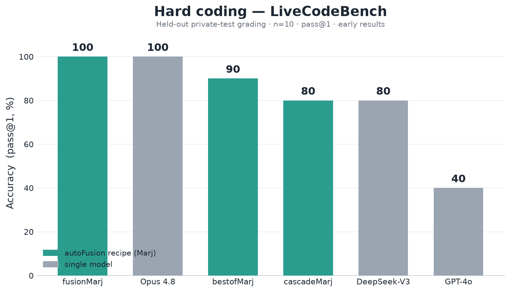
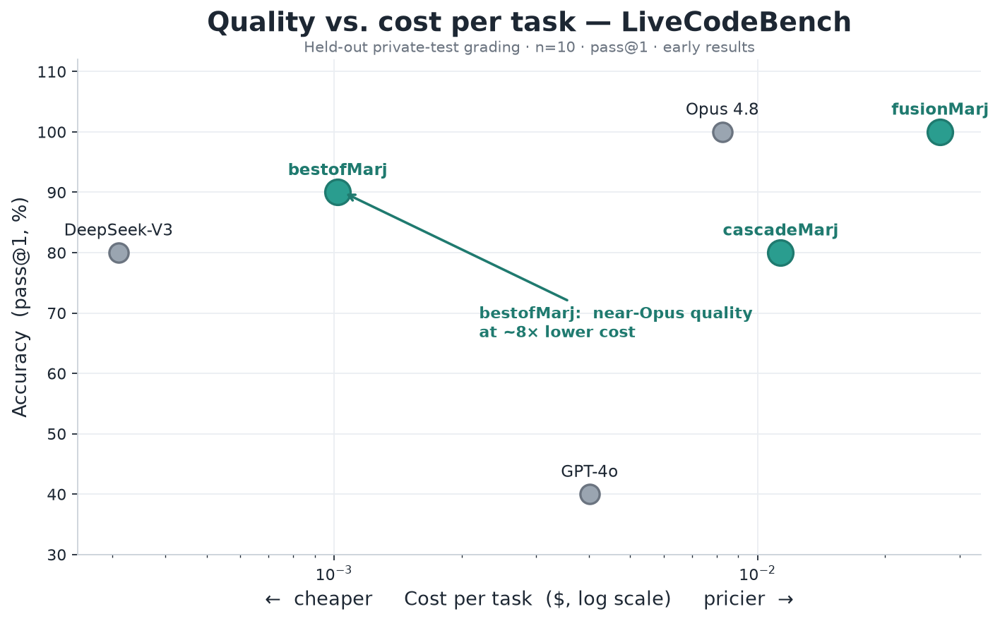
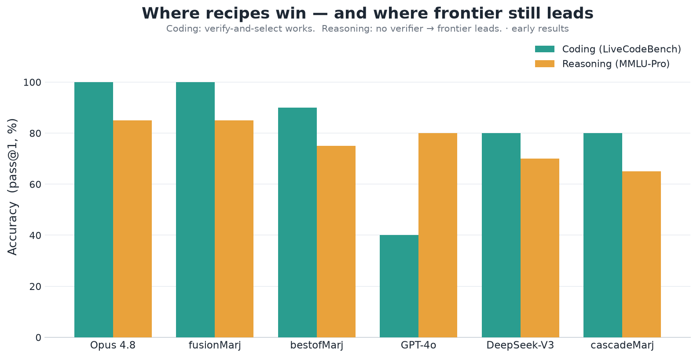

# autoFusion

> Open-source, developer-first **multi-model fusion harness** with a built-in eval harness that *proves* when fusion beats a single model — instead of asserting it.

## Thesis

A single frontier model commits to one draw from its distribution and inherits its own blind spots. A **fusion harness** sends a task to several models in parallel (**proposers**), then has an **aggregator** synthesize their outputs into a final answer — a Mixture-of-Agents (MoA) architecture. On benchmarks this can exceed the best individual model, at the cost of N× the calls.

autoFusion is the self-hostable version of that. **The code is free; you bring your own API keys** — or run fully local via [Ollama](https://ollama.com) for a true **$0 path**. We don't claim fusion is better; the built-in eval harness lets you measure it on your own tasks, including against the **aggregator running alone** (the honest baseline).

**More than a router.** A router picks *one* model per task — cheaper, but bounded by the best single model. Fusion runs several and synthesizes; verify-and-select samples several and lets a test pick the winner. Both ship today (`routeMarj`, `fusionMarj`, `bestofMarj`, `cascadeMarj`).

## Early results (measured, not asserted)

Small-*n*, held-out, directional — a thermometer, not a verdict. But the pattern is already clear: **on work you can check, fused recipes reach frontier quality for a fraction of the cost; on open reasoning, the frontier still leads.**

### Hard coding — where verify-and-select shines



On LiveCodeBench (contamination-resistant, **private held-out grading**, n=10) the autoFusion recipes land shoulder-to-shoulder with Opus 4.8 — `fusionMarj` ties it at 100%, `bestofMarj` reaches 90% — while GPT-4o alone manages 40%.

### Same quality, a fraction of the cost



The headline: **`bestofMarj` reaches near-Opus quality at ~8× lower cost per task.** The verifier (the tests) does the work you'd otherwise pay a bigger model for.

### The honest boundary — coding vs. reasoning



Coding is *verifiable*, so verify-and-select wins. Reasoning (MMLU-Pro) has no test to select on — so the frontier keeps its edge. We show both, because the boundary **is** the finding.

> **Caveats, stated plainly:** n=10 (coding) / n=20 (reasoning); LiveCodeBench is graded on held-out private tests — an earlier "bestofMarj 100%" was verifier=grader inflation, since fixed. These are early numbers meant to show *direction*, not a final leaderboard.

## The honest cost story

Fusion is **N+1 calls per request** (N proposers + 1 aggregation). It can silently multiply a bill, so budget caps are first-class. Recent research ([Self-MoA](https://arxiv.org/abs/2502.00674)) also found mixing models sometimes *loses* to sampling one good model, and that much of MoA's gain comes from the aggregator. autoFusion's stance: **don't trust the claim — run the eval.** That's why the eval harness is built before the fusion orchestrator.

## Status

Working end-to-end, local-$0 by default. Built so far:

- **Plumbing + eval harness** — [LiteLLM](https://github.com/BerriAI/litellm) providers + local Ollama through one interface; deterministic sandboxed pass@1 scoring; per-model **and** per-recipe leaderboard ("the thermometer").
- **Recipes** — `fusionMarj` (MoA), `bestofMarj` (verify-and-select), `routeMarj`, `cascadeMarj`, and `delegate` (lead + sidekick) — all scored by the same eval.
- **Benchmarks** — HumanEval, LiveCodeBench (held-out private grading), GSM8K, MMLU-Pro; a cross-task `report` and a recipe `optimize` sweep over the quality×cost frontier.
- **Agentic** — a tool-using agent loop, best-of-N trajectories, a local bug-fix suite, and a SWE-bench predict→grade harness.

The numbers above are early and directional. See [`fusion-harness-build-brief.md`](fusion-harness-build-brief.md).

## Quickstart

```bash
uv sync                                     # install
ollama serve & ; ollama pull llama3.2       # local $0 path — no key needed
ollama pull qwen2.5:3b                       # a second proposer (for fusion)

uv run autofusion init                       # scaffold autofusion.toml + show key/endpoint status
uv run autofusion config-check               # which models/keys are usable
uv run autofusion smoke -m llama3.2          # call one model end-to-end
uv run autofusion fuse "your prompt"         # run fusion (MoA) on one prompt
uv run autofusion eval -m llama3.2,fusion -n 5   # score baselines + fusion on HumanEval
uv run autofusion budget status              # show the configured cost caps
uv run autofusion serve                      # OpenAI-compatible endpoint on :8000
```

Point any OpenAI client at `http://localhost:8000/v1` and use `model: "fusion"` (or a configured model name). All commands accept `-c/--config <path>`; for hosted models, `cp .env.example .env` and add a key. Budget caps in `[budget]` are enforced **before** any call fires.

Edit [`autofusion.toml`](autofusion.toml) to register models (litellm id, optional `api_base`, per-token cost; `0` = free/local).

### Local proposers + frontier aggregator (the cost sweet spot)

Phase 3 found fusion's gains hinge on a **strong aggregator**, not on the proposers. So the highest-value config drafts with cheap **local** Ollama models and synthesizes with **one hosted frontier model** — you pay for exactly **one** strong call per request while the N proposer drafts cost nothing:

```bash
# needs only OPENAI_API_KEY in .env — proposers are local
autofusion -c configs/local-plus-frontier.toml fuse "your prompt"
```

See [`configs/local-plus-frontier.toml`](configs/local-plus-frontier.toml). If the aggregator's key is missing, `config-check` flags it (`MISSING OPENAI_API_KEY`) rather than crashing, and the tight `[budget]` cap is your safety net since only the aggregator spends.

## Finding the best recipe: `optimize`

The headline workflow. For a job (a benchmark, for now), autoFusion sweeps candidate recipes — every single model you can call, plus `fusion`/`route`/`cascade` — over the **available** model pool and reports the **quality×cost Pareto frontier** with a recommended recipe:

```bash
autofusion optimize -b livecodebench -n 50
```

"Available" = callable right now = **local Ollama + any model whose API key is present**. Add a key and the pool (and the frontier) grows. The frontier (★) is the set of recipes where you can't get more quality without paying more — everything behind it is strictly wasteful. It tells you, per job, *which* combination of models to fuse (or whether to fuse at all): on an easy job the cheap model may dominate and fusion is off the frontier; on a hard one a diverse fused recipe may push the frontier past any single model. You don't assert which recipe is best — you measure it.

## The cheap path to high quality: verified best-of-N

On **verifiable** tasks (code, math) you often don't need a frontier model at all. Sample N candidates from a basket of cheap/diverse models and let the **verifier** (the tests) pick the winner — pass@k climbs fast with samples, and the verifier collapses them back to one *correct* answer with no model-judgment in the loop:

```bash
autofusion eval -m bestofn -b humaneval      # in eval, the real test scorer is the verifier
autofusion bestofn "your prompt"             # ad-hoc: no tests, a critic model picks instead
```

Configured in `[bestofn]` (`models` basket, `n`, `critic`, `temperature`). In one local run, best-of-4 over three small models hit **100%** where the best single small model managed **75%** — $0, no frontier call. For non-verifiable tasks a `critic` model picks the best candidate (its ceiling is the critic's own quality, so there one strong model helps).

## The scoreboard: `report`

Compare **autoFusion's recipes vs. every model you can call**, across multiple task types, in one table:

```bash
autofusion report --benchmarks humaneval,gsm8k -n 50
```

Rows are flagged `model` ("them") vs `RECIPE` ("us"); columns are each task's pass@1 (★ = task winner) plus an average and $/task; the footer calls the headline — **best autoFusion recipe vs. best single model**. The pool is availability-gated, so the day you add an Anthropic/OpenAI/Gemini key, those frontier models drop in as rows and this becomes the real "us vs. the big models, on various tasks" comparison — with cost attached, and nothing asserted.

## Cutting cost: the cascade

Fusion raises the quality *ceiling* but costs N× calls. The **cascade** does the opposite — it holds quality and drops *cost*: try the **cheapest** model first, have a cheap **critic** score the answer, and **escalate** to a stronger tier (or to `fusion`) only when confidence is low. Most requests resolve at the cheap tier, so you pay frontier prices only on the hard tail (the idea behind Cognition's "frontier quality at ~35% lower cost").

```bash
autofusion cascade "your prompt"            # cheap -> critic -> escalate
autofusion eval -m cheap,frontier,cascade,fusion -n 50   # see the cost/quality frontier
```

Configured in `[cascade]` (`tiers` cheapest-first, a `critic` model, a `threshold`). A tier can be a model, `fusion`, or `route`.

**Honest caveat:** the critic is an LLM-judge, so it can be biased. We blunt that three ways: use a *cheap, separate* model as critic; **fail-safe to escalation** when the critic is unsure or unparseable (never silently trust a bad answer); and **measure final quality deterministically** with `eval` — so you can confirm the cascade actually held quality while cutting cost, rather than taking it on faith. Tune `threshold` from the eval, not by guessing.

## Benchmarking against frontier models

The thesis is "fusion can beat the best single frontier model." Test it with the same `eval` instrument — fusion is scored like any model:

```bash
# needs the relevant API keys in .env. Spends REAL money — caps in the profile fire first.
autofusion -c configs/frontier-bench.toml eval -b livecodebench \
    -m gpt-4o,claude-sonnet,gemini,fusion -n 50
```

Why **LiveCodeBench** and not HumanEval: frontier models score ~90%+ on HumanEval, so there's no headroom to detect a gain. LiveCodeBench is contamination-resistant and lands frontier models ~50-70%, leaving room to see whether fusion actually helps. The leaderboard reports the decisive paired metric — **pass@1 delta + cost/call multiple + the aggregator-alone baseline** — so you can answer "did fusion beat the best single model by *more than its cost multiple costs*?" honestly. (v1 grades stdin/stdout problems on public tests; functional/LeetCode problems are skipped and logged.)

## Security note

HumanEval grading **executes model-generated code**. autoFusion runs each program in an isolated subprocess with a hard timeout, CPU/memory/file-size limits, and a reliability guard that neuters destructive syscalls (`src/autofusion/eval/sandbox.py`). This is adequate for benchmark models you control — **not** a boundary for adversarial code. For untrusted-at-scale use, run inside a locked-down container (no network, gVisor/seccomp).

## Auth: API keys only (by design — don't re-add subscription auth)

autoFusion authenticates to providers with **API keys only**, read from the environment / `.env`. It deliberately does **not** support subscription or CLI-token auth (extracting a session token from a desktop/CLI subscription). For a tool that strangers self-host, that path is a **ToS/ban risk** and is no longer cost-advantaged. This is a settled decision — please don't re-introduce it. Local models via Ollama need no key at all (the true $0 path).

## Model registry & maintenance

Per-model **cost and limits come from LiteLLM's `model_cost` map** (auto-pulled, kept current upstream), with a **config-level override**: set `input_cost_per_token` / `output_cost_per_token` in any `[[models]]` entry (`0` marks free/local and skips budget checks). So the registry is *auto-pulled + community/config override* — no hand-maintained price table to rot. If a model's cost shows as `0`/unknown, set it explicitly in your config.

## Contributing

See [CONTRIBUTING.md](CONTRIBUTING.md). The one hard rule: **never weaken the eval** — calibration tests against known-correct solutions must stay green.

## License

Apache 2.0.
